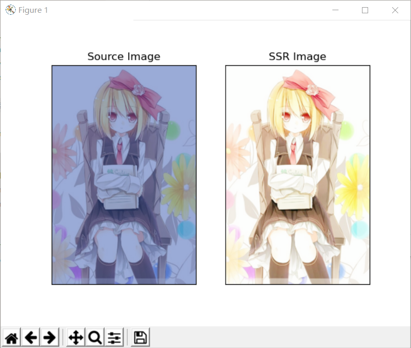
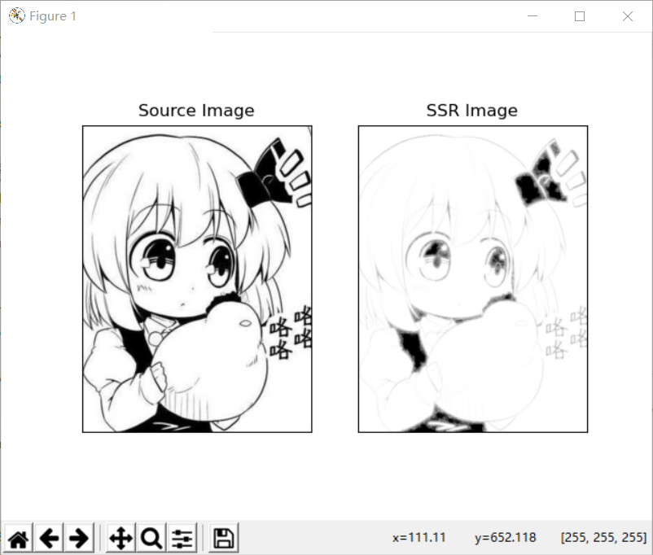

# __Retinex图像增强（只学了SSR）__
## 简介
1963年12月30日E. Land作为人类视觉的亮度和颜色感知的模型在俄亥俄州提出了一种颜色恒常知觉的计算理论———__Retinex理论__。Retinex是一个合成词，它的构成是retina（视网膜）+cortex（皮层）→ Retinex。40多年来，工作在IS&T、NASA的J. J. McCann和D. J. Jobson、Zia-Ur Rahman、G. A. Woodell等人模仿人类视觉系统发展了Retinex算法，从单尺度Retinex算法（single scale retinex, SSR）改进成多尺度加权平均的Retinex算法（multi-scale retinex, MSR），再发展成带彩色恢复的多尺度Retinex算法（multi-scale retinex with color restoration, MSRCR）。

<p>Retinex 理论主要包含了两个方面的内容: 物体的颜色是由物体对长波、中波和短波光线的反射能力决定的,而不是由反射光强度的绝对值决定的;物体的色彩不受光照非均性的影响,具有一致性。</p>


## 原理
Retinex理论的基本假设是原始图像***S***是光照图像***L***和反射图像***R***的乘积,即可表示为下式的形式：  

- __*S(x,y)=R(x,y)∙L(x,y)*__

基于Retinex的图像增强的目的就是从原始图像***S***中估计出光照***L***，从而分解出***R***，消除光照不均的影响，以改善图像的视觉效果,正如人类视觉系统那样。在处理中，通常将图像转至对数域，即

- __*log(S)=log(R)+log(L)*__


- __*s=r+l*__

Retinex方法的核心就是估测照度***L***，从图像***S***中估测***L***分量，并去除***L***分量，得到原始反射分量***R***，  
即：

- __*l=f(s)*__

- __*r=s−f(s)*__

函数 __*f(x)*__ 实现对照度***L***的估计
***

## 单尺度Retinex: SSR（Single Scale Retinex）

- ___Log(R(x,y))=( Log(S(x,y))−Log(S(x,y)∗G(x,y)) )___ 
- ___R(x,y)=(Value−Min)/(Max−Min)∗(255−0)___　　　　　

重点是如何求***L(x,y)***，直接求是不可能的，这里是用原图卷积一个高斯核来近似表示。

写这个代码时遇到很多问题，借鉴了一下网上找到的代码，但是实际上和公式不一样，**S**与**G**卷积后直接输出会有问题，这里进行了一次相乘，我也不是很理解，研究了一宿，最终还是没完全明白。

***
### 代码：

```python
import numpy as np
from cv2 import cv2
from matplotlib import pyplot as plt


def replaceZeroes(data):
    min_nonzero = min(data[np.nonzero(data)])
    data[data == 0] = min_nonzero
    return data


def ssr_c(img, size):
    img_G = replaceZeroes(cv2.GaussianBlur(img, (size, size), 0))
    img = replaceZeroes(img)
    # img_G = cv2.GaussianBlur(img, (size, size), 0)
    log_S = cv2.log(img/255.0)
    g_L = cv2.log(img_G/255.0)
    log_L = cv2.multiply(log_S, g_L)
    log_R = cv2.subtract(log_S, log_L)
    dst_R = cv2.normalize(log_R, None, 0, 255, cv2.NORM_MINMAX)
    R_c = cv2.convertScaleAbs(dst_R)
    return R_c


def singleScaleRetinex(img, size):
    # cv2.imshow('G', cv2.GaussianBlur(img, (size, size), 0))
    b_gray, g_gray, r_gray = cv2.split(img)
    Rb_ssr = ssr_c(b_gray, size)
    Rg_ssr = ssr_c(g_gray, size)
    Rr_ssr = ssr_c(r_gray, size)
    R = cv2.merge([Rb_ssr, Rg_ssr, Rr_ssr])
    return R


if __name__ == '__main__':
    img = 'Rumia_B.jpg'

    src_img = cv2.imread(img)

    result = singleScaleRetinex(src_img, 15)

    source = cv2.cvtColor(src_img, cv2.COLOR_BGR2RGB)
    result = cv2.cvtColor(result, cv2.COLOR_BGR2RGB)

    titles = ['Source Image', 'SSR Image']
    images = [source, result]
    for i in range(2):
        plt.subplot(1, 2, i+1), plt.imshow(images[i], 'gray')
        plt.title(titles[i])
        plt.xticks([]), plt.yticks([])
    plt.show()

```
### 效果：


SSR在**R**（未受污染的图像）颜色分明时效果不错，但是当原本颜色本就不分明时，或者叠加的**L**不明显时效果很差。  
如下图。



这是由于计算***L***时的卷积运算实际上就是高斯模糊的缘故。