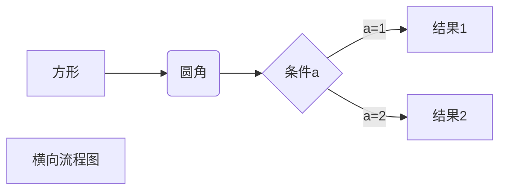

*** 
# title
## sub
### subsub
---
- - -
******
- list
* dfg
1. dfg
    - dfgdg
    - 
    * dgfgdgh
    + gfhhjjdg
    + [link](www.github.com)
    - <www.github.com>
    - _rgfg_**i**___sd___<u>sfsfsf</u>  <u>dffasjdhgkdshfuidh  
    1. > dfdsfdfdsfdf</u>
    2. <sup>123</sup>
    3. [^sd]
    - `py`
    ```python
    import something
    def func(x):
        pass
    ```      
***
链接也可以用变量来代替，文档末尾附带变量地址：
这个链接用 1 作为网址变量 [Google][1]
这个链接用 runoob 作为网址变量 [Runoob][runoob]
然后在文档的结尾为变量赋值（网址）  
 
<a href="http://www.runoob.com">这是一个链接</a>

[](https://github.com/EoralMilk/HelloOpenCV/blob/master/skly1.jpg)  
***
[](https://github.com/EoralMilk/HelloOpenCV/blob/master/skly1.jpg)
<hr>

|   A    |    B | C    |
| :----: | ---: | :--- |
| **！** |    s | dsaf |
<hr>  

使用 <kbd>Ctrl</kbd>+<kbd>Alt</kbd>+<kbd>Del</kbd> 重启电脑  

[1]: http://www.google.com/
[runoob]: http://www.runoob.com/

[^sd]: fdf
